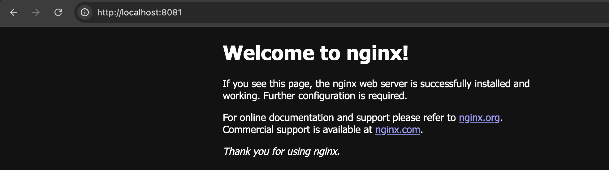
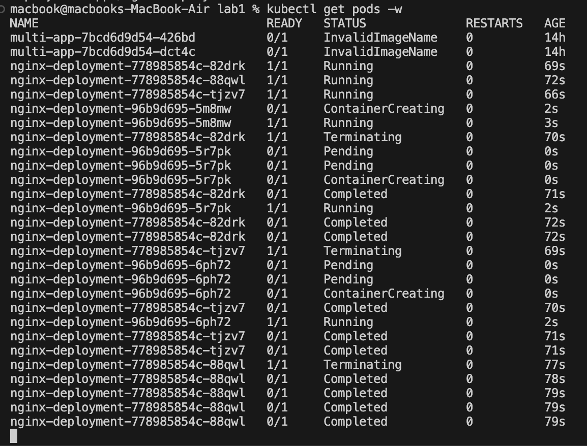
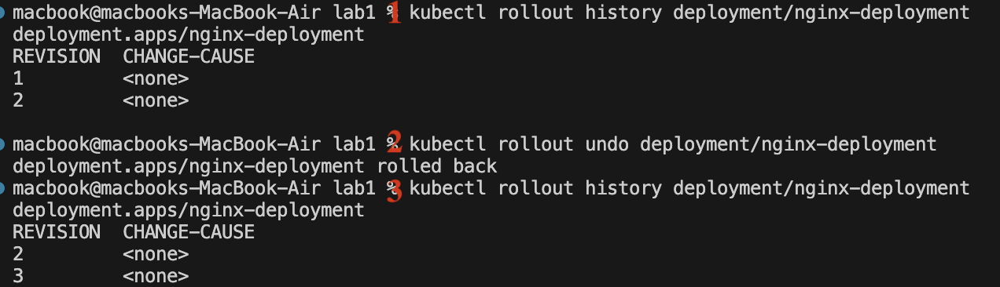
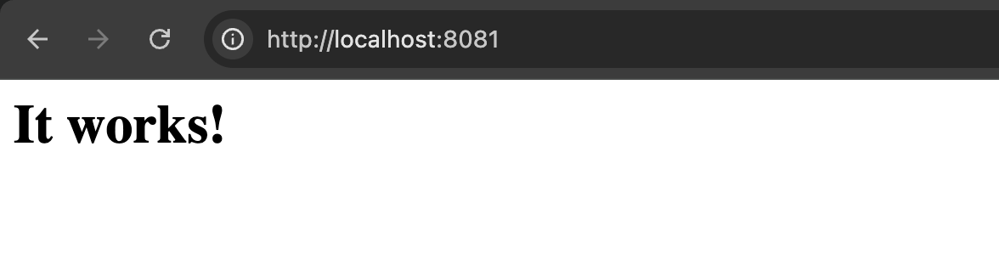

# Kubernetes Deployment & Rollback Task 🚀

This guide explains how to deploy an NGINX application, update it to Apache, and roll back to the previous version in Kubernetes. It includes key steps for managing deployments effectively. 🛠️

---

## 📌 Steps Overview

1. **Deploy NGINX with 3 replicas** 🏗️
2. **Expose the deployment using a service** 🌍
3. **Access the service locally via port forwarding** 🔗
4. **Update the deployment to Apache** 🔄
5. **Monitor the update process** 👀
6. **Check deployment rollout history** 📜
7. **Roll back to NGINX** ⏪
8. **Monitor rollback process** 📊
9. **Verify the deployment status** ✅
10. **Cleanup resources** 🧹

---

## 📌 What We Did

### 1️⃣ Deploying NGINX with Multiple Replicas
We created a Kubernetes deployment with **three NGINX instances** to ensure high availability.
```bash
kubectl apply -f nginx-deployment.yaml
```
### 2️⃣ Exposing the Deployment via a Service
A **Kubernetes service** added to expose the NGINX deployment , i use ClusterIP ===>is only accessible internally within the cluster, It is not exposed to the outside world
```bash
kubectl apply -f nginx-service.yaml
```
### 3️⃣ Accessing NGINX Locally
so i used **port forwarding** to map a local port to the service, 
```bash
kubectl port-forward svc/nginx-service 8081:80
```
This command will forward local port 8081 to port 80 of the service. can now access NGINX via http://localhost:8080 

 📸

### 4️⃣ Updating NGINX to Apache
Instead of redeploying, i **updated the image** in the deployment to replace NGINX with **Apache HTTP Server** dynamically. Kubernetes performed a **rolling update**, ensuring zero downtime.
```bash
kubectl set image deployment/nginx-deployment nginx=httpd:latest
```
### 5️⃣ Monitoring the Update Process
We watched how pods **terminated and recreated** during the update to Apache, ensuring a smooth transition.
```bash
kubectl get pods -w
```
📸

### 6️⃣ Checking Deployment History & Rolling Back to NGINX
 **rollout history**, allowing us to track changes & **rollback feature** to revert the deployment to the previous stable version (NGINX)
```bash
kubectl rollout history deployment/nginx-deployment
```
📸

### 7️⃣ Access the Service:
to ensure that apache is available

📸

---

## 🎯 Key Takeaways
- Kubernetes **deployments** allow easy updates and rollbacks.
- **Rolling updates** ensure smooth transitions with minimal downtime.
- Kubernetes **rollback capabilities** help revert to stable versions if needed.
- **Monitoring pods** during updates/rollbacks ensures successful transitions.

This step-by-step approach ensures efficient application management in a Kubernetes environment. 🚀

