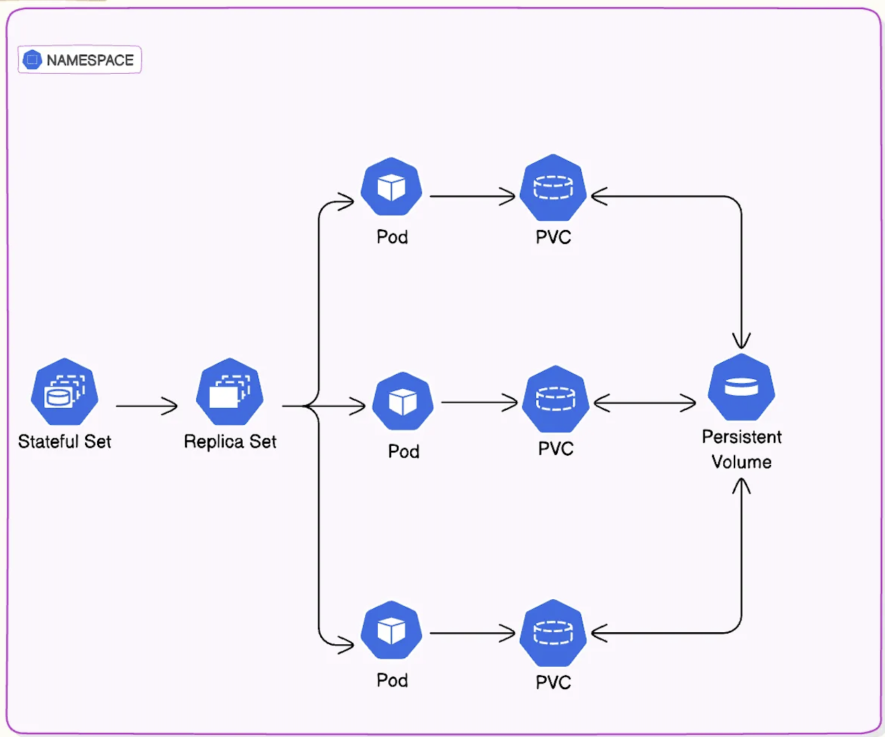

# **📌 Deployment vs. StatefulSet in Kubernetes**  

 📸

## **📖 Introduction**  

In Kubernetes, applications can be either **stateless** or **stateful**, depending on how they handle data.  

- **Stateless applications** process each request independently and do not retain data.  
- **Stateful applications** store and track data across multiple interactions.  

Since stateful applications require persistent data, Kubernetes provides **StatefulSet**, a controller designed specifically to manage them.  

---

## **⚡ What is StatefulSet?**  

A **StatefulSet** is a Kubernetes controller used to manage **stateful applications** like databases or applications that require stable network identities and persistent storage. Unlike Deployments, which are designed for stateless applications
---

## Comparison: Deployment vs. StatefulSet 🔍  

### **Deployment (For Stateless Applications):**  
✔ Does not guarantee **stable pod names**; new pods get randomly assigned names.  
✔ Does not provide **built-in persistent storage management**.  
✔ Useful for applications that **do not need ordered pod startup or stable identities**.  
✔ Best suited for **web servers, APIs, and microservices**.  

### **StatefulSet (For Stateful Applications):**  
✔ Ensures each pod has a **unique, stable identity** (`pod-0`, `pod-1`, etc.).  
✔ Manages **PersistentVolumeClaims (PVCs)**, ensuring each pod gets **dedicated storage**.  
✔ Pods are created and terminated **in a defined sequence** to maintain data consistency.  
✔ Best suited for **databases (MySQL, MongoDB) and distributed applications**.
---

## **MySQL StatefulSet Configuration** 🛢️  

The YAML defines a **MySQL StatefulSet** with **3 replicas**, ensuring **persistent storage and stable pod names**.  

---

## **Service Configuration for MySQL StatefulSet** 🌐  

To expose MySQL within the cluster, a **headless service** (`clusterIP: None`) is required. This allows other applications to discover MySQL pods using **stable DNS names**.  

---

## **Verification** ✅  

After applying the configurations, verify the setup with the following commands:  

```sh
kubectl get statefulsets
kubectl get pods -l app=mysql
kubectl get pvc
kubectl get svc mysql
```

To connect to MySQL:  

```sh
mysql -h mysql-0.mysql.default.svc.cluster.local -u root -p
```

---

### **Conclusion** 🎯  

- Use **Deployment** for **stateless applications** like web servers.  
- Use **StatefulSet** for **stateful applications** like databases that need **persistent storage and stable identities**.  
- The MySQL StatefulSet setup ensures **data consistency, reliable scaling, and stable network identities**.  

🚀 **Now your Kubernetes cluster is ready to run a reliable MySQL database!** 🎉  

---
