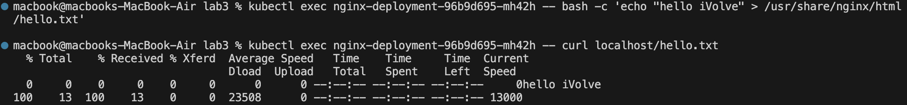
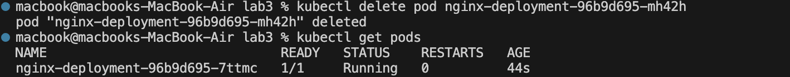
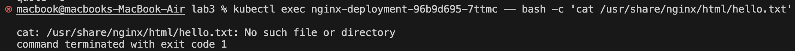
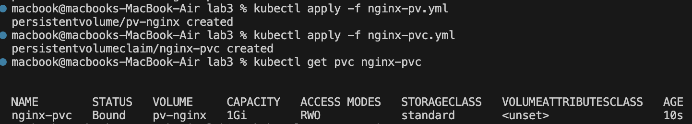
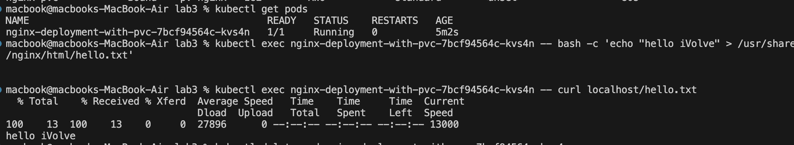
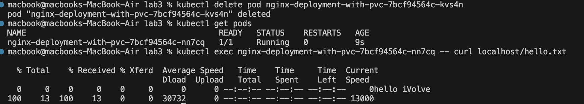

 📸

# 📌 Kubernetes Storage Configuration Documentation  

This task outlines the process of creating a **stateful NGINX deployment** in Kubernetes with persistent storage using a **Persistent Volume (PV)** and **Persistent Volume Claim (PVC)**. It demonstrates how data persists across pod restarts and deletions.

---

## ⚡ Part 1: Initial Setup without Persistence  

### 🔹 Step 1: Create NGINX Deployment  
Apply the deployment:
```bash
kubectl apply -f nginx-deployment.yml
```

### 🔹 Step 2: Create and Verify a Test File  
```bash
# Create a test file  
kubectl exec $POD_NAME -- bash -c 'echo "hello iVolve" > /usr/share/nginx/html/hello.txt'

# Verify the file is served  
kubectl exec $POD_NAME -- curl localhost/hello.txt
```
 📸

### 🔹 Step 3: Demonstrate Data Loss  
```bash
# Delete the pod  
kubectl delete pod $POD_NAME  

# Verify the file is gone  
kubectl exec $NEW_POD_NAME -- bash -c 'cat /usr/share/nginx/html/hello.txt'
```
 📸
 📸

---

## 🎯 Part 2: Setup with Persistence  

### 🔹 Step 1: Create a Persistent Volume (PV)  
```bash
kubectl apply -f nginx-pv.yml
```

### 🔹 Step 2: Create a Persistent Volume Claim (PVC)  
```bash
kubectl apply -f nginx-pvc.yml
```

### 🔹 Step 3: Deploy NGINX with PVC  
Apply the deployment:
```bash
kubectl apply -f nginx-deployment-with-pvc.yml
```
 📸

### 🔹 Step 4: Verify Data Persistence  
```bash
# Create a test file  
kubectl exec $POD_NAME -- bash -c 'echo "hello iVolve" > /usr/share/nginx/html/hello.txt'

# Verify the file is served  
kubectl exec $POD_NAME -- curl localhost/hello.txt

```
 📸

```bash
# Delete the pod  
kubectl delete pod $POD_NAME

# Verify the file still exists  
kubectl exec $NEW_POD_NAME -- curl localhost/hello.txt
```
 📸

---

## 🔍 Comparison of Storage Components

 📸-1.webp)

### 📦 Persistent Volume (PV)  
✅ A **PV** is a piece of storage in the cluster that has been provisioned by an administrator or dynamically using **Storage Classes**.  
✅ It is a resource in the cluster, just like a **node**.  
✅ PVs have a lifecycle **independent** of any individual Pod.  

### 📝 Persistent Volume Claim (PVC)  
✅ A **PVC** is a request for storage by a user.  
✅ It acts similarly to a **Pod**, as it **consumes PV resources**.  
✅ PVCs can request **specific sizes** and **access modes**.  

### 🏗️ Storage Class  
✅ A **StorageClass** describes different "classes" of storage available in the cluster.  
✅ It acts as a **template** for **dynamic provisioning**.  
✅ Useful for specifying different types of storage (e.g., SSD, HDD, Network Storage).  

---


