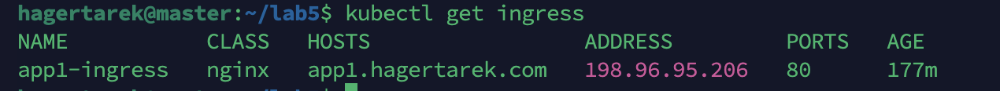
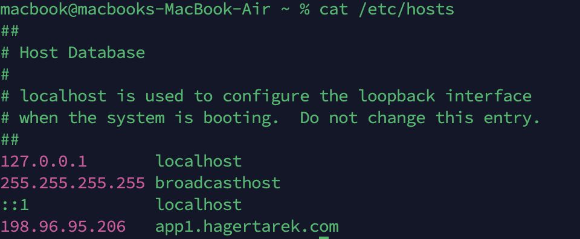
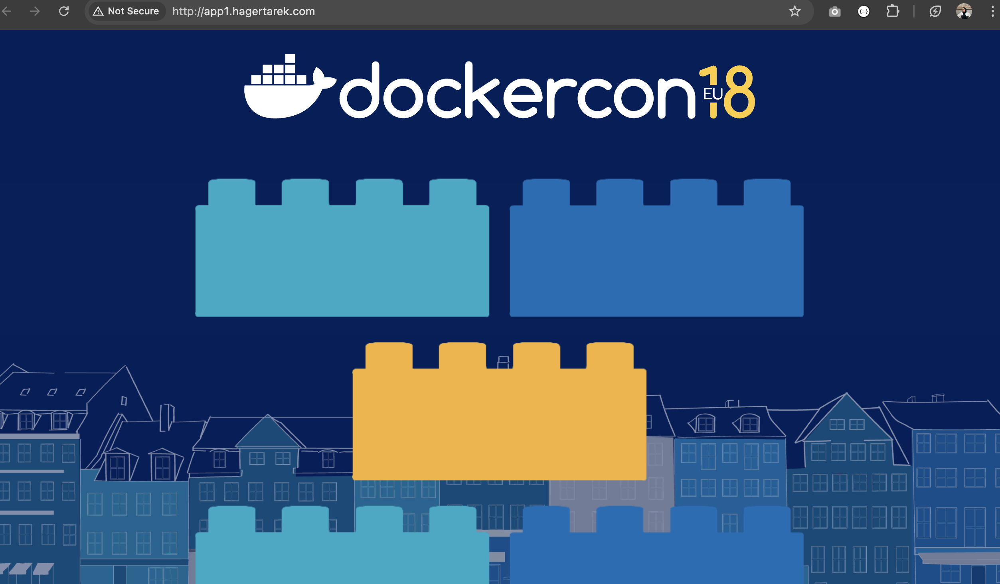

# Kubernetes Deployment with Ingress 🚀

## Overview 📌
This task for deploying an application on Kubernetes using Minikube, setting up a secure network policy, and exposing it via an Ingress controller.

---

## 1️⃣ Build and Push Docker Image 📦
Build a Docker image from the repository and push it to Minikube's internal registry.
```bash
git clone https://github.com/IbrahimAdell/App1.git
cd App1
docker build -t app1-image:latest .
minikube start
docker tag app1-image:latest hagert/app1-image:latest
docker push hagert/app1-image:latest
```

---

## 2️⃣ Create Kubernetes Deployment ☸️
Deploy the application on Kubernetes by creating a deployment manifest.
```bash
kubectl apply -f deployment.yaml
```

---

## 3️⃣ Create a Service 🛜
Expose the deployment using a ClusterIP service to allow internal communication.
```bash
kubectl apply -f service.yaml
```

---

## 4️⃣ Define a Network Policy 🔐
By default, pods in Kubernetes can communicate freely. To improve security, a network policy is used to restrict traffic, allowing communication only between pods within the same namespace. This prevents unauthorized access from other parts of the cluster.
```bash
kubectl apply -f network-policy.yaml
```

---

## 5️⃣ Configure Ingress for External Access 🌐
In this setup, i worked within the `zero` namespace where the Ingress controller is already deployed.

1. Created the Ingress resource to define routing rules, allowing external requests to reach the correct service inside the cluster.
**notice to add the following line in the in the Ingress resource to specify which Ingress controller should handle the traffic for this Ingress rule**
```bash
ingressClassName: nginx
```

2. Retrieved the Ingress IP address using `kubectl get ingress` to determine the external access point.

 📸

3. Updated the `/etc/hosts` file to map the Ingress IP to the custom domain, ensuring easy access to the service.
**make it local**

 📸

This process ensures that external users can access the application through a human-readable domain instead of an IP address.

---
## 6️⃣ in step 2 we Create an Ingress Resource 🚪
Ingress resources define rules for directing traffic based on domain names and paths. Instead of manually mapping ports, we use Ingress to expose services using a clean, user-friendly domain.

---

## 7️⃣ in step 3 we Map Domain to Ingress IP 🏠
Since Kubernetes does not handle DNS resolution automatically, we manually map the Ingress IP to our custom domain in `/etc/hosts`. This allows us to access the application using a meaningful domain instead of an IP address.

---

## 8️⃣ Access the Application 🌍
Visit the application using the configured domain in a browser:
**http://app1.hagertarek.com**

 📸

---

## 📖 Ingress Controller vs. Ingress ⚖️
| Feature            | Ingress Controller 🏗️ | Ingress Resource 🚦 |
|-------------------|--------------------|------------------|
| Role             | Manages ingress traffic | Defines routing rules |
| Function        | Load balances requests | Specifies how to route traffic |
| Implementation | NGINX, Traefik, HAProxy | YAML-based configuration |

📌 **Ingress Controller**: The actual implementation that manages external access.
📌 **Ingress Resource**: A set of rules applied to the controller.

---
