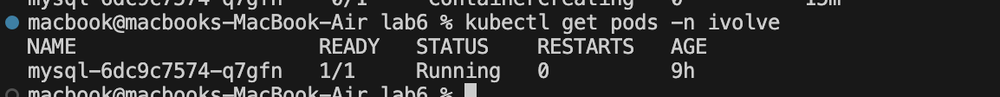
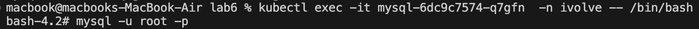
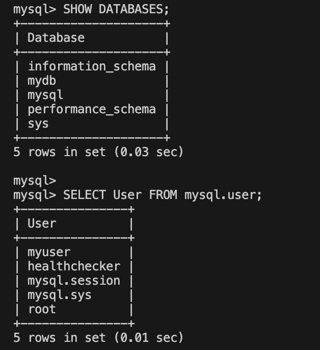

# 🚀 Kubernetes: Storing Data & Setting Resource Limits

## 📌 Objective
Deploy a MySQL database in a Kubernetes cluster while:
- Creating a dedicated namespace `iVolve`.
- Applying resource quotas to limit the number of pods.
- Deploying MySQL with specific CPU & Memory requests/limits.
- Managing database configurations using ConfigMaps & Secrets.
- Verifying the setup inside the MySQL pod.

---

## 🏗️ Steps

### 1️⃣ Create Namespace
```sh
kubectl create namespace ivolve
```

### 2️⃣ Apply Resource Quota
Define a resource quota to limit the number of pods.
Apply it:
```sh
kubectl apply -f resource-quota.yaml
```

### 3️⃣ Create a ConfigMap for MySQL
```yaml
data:
  database: "mydb"
  user: "myuser"
```
Apply it:
```sh
kubectl apply -f mysql-config.yaml
```

### 4️⃣ Create a Secret for MySQL Passwords
```sh
data:
  root-password: cm9vdHBhc3N3b3Jk  
  user-password: dXNlcnBhc3N3b3Jk 
```

### 5️⃣ Deploy MySQL with Resource Requests & Limits
Apply it:
```sh
kubectl apply -f mysql-deployment.yaml
```

### 6️⃣ Verify MySQL Setup Inside Pod
1. Get the MySQL pod name:
   ```sh
   kubectl get pods -n ivolve
   ```
📸

2. Exec into the pod & Login to MySQL:
   ```sh
   kubectl exec -it mysql-xxxxx -n iVolve -- bash
   mysql -u root -p
   ```
📸

3. Verify database:
   ```sql
   SHOW DATABASES;
   ```
📸

✅ Done! 