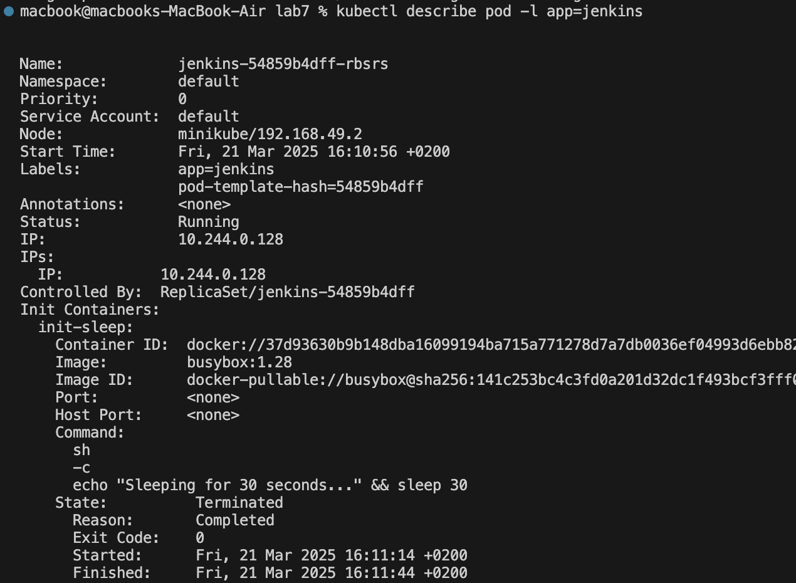
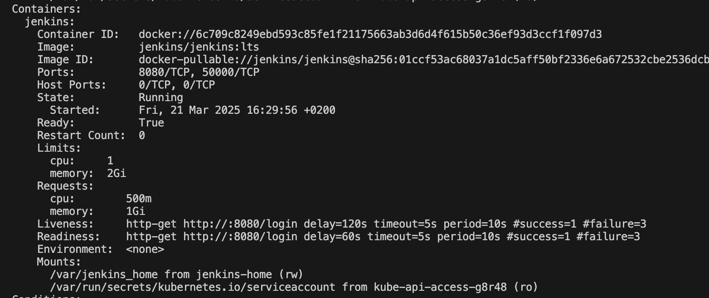
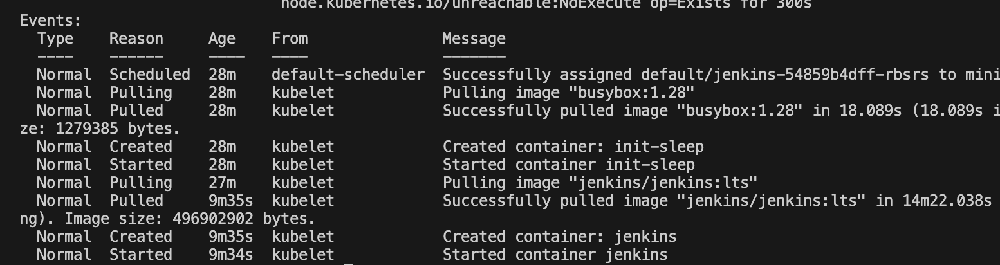
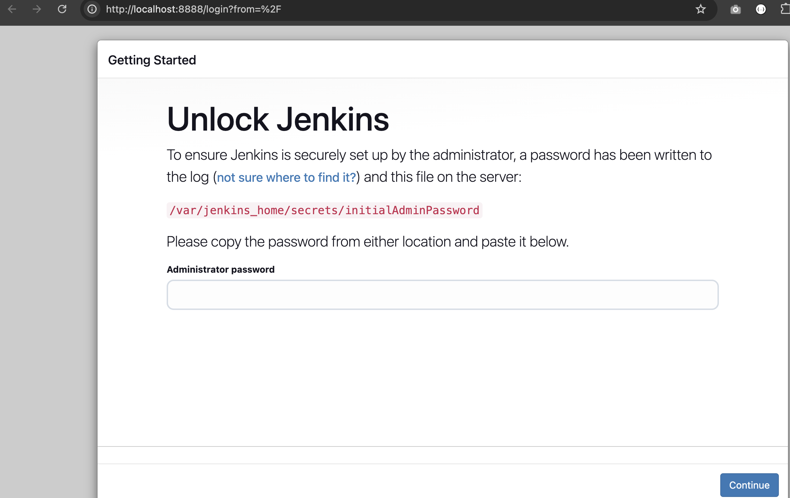

# Multi-container Applications in Kubernetes 🚀

## Project Overview
This guide demonstrates deploying Jenkins on Kubernetes using multi-container pod patterns and health checks.

## Key Components
- 🔄 Init container that runs before Jenkins starts
- 🔍 Readiness and liveness probes to ensure availability
- 🌐 NodePort service for external access
- ⏩ Port forwarding for direct pod communication

## Step 1: Create Jenkins Deployment 📝
I created a deployment manifest that includes:
- An init container that sleeps for 30 seconds before Jenkins starts
- A main Jenkins container with both readiness and liveness probes
- Resource limits and persistent volume for Jenkins data

The init container simulates a preparation task that must complete before Jenkins launches.

## Step 2: Create NodePort Service 🔌
We set up a NodePort service to make Jenkins accessible outside the cluster:
- Exposed port 8080 for the Jenkins web interface
- Exposed port 50000 for Jenkins agent connections
- Assigned specific NodePorts (30080 and 30050)

## Step 3: Deploy to Kubernetes ✨
Applied our manifests to the Kubernetes cluster:
```bash
kubectl apply -f jenkins-deployment.yaml
kubectl apply -f jenkins-service.yaml
```

## Step 4: Verify Deployment 🔎
Used kubectl commands to check the deployment status:
```bash
kubectl get pods -l app=jenkins
```
📸

```bash
kubectl describe pod -l app=jenkins
```
The output showed:
## 1. Init Container Status
- The init container named **"init-sleep"** ran successfully.
- It started at **16:11:14**, ran for **30 seconds**, and finished at **16:11:44**.
- Its state is **"Terminated"** with **"Reason: Completed"** and **"Exit Code: 0"**, indicating it completed successfully.
- The executed command: `echo "Sleeping for 30 seconds..." && sleep 30`.
📸

## 2. Main Jenkins Container
- The Jenkins container started at **16:29:56**, about **18 minutes** after the init container completed.
- It is currently in **"Running"** state with **"Ready: True"**.
- **Readiness and liveness probes** are correctly configured with the specified paths and timing.
- **Resource limits and requests:**
  - **CPU:** 500m - 1 CPU
  - **Memory:** 1Gi - 2Gi

📸

## 3. Events Timeline
- The **init container** took about **18 seconds** to pull before running.
- The **Jenkins image** took much longer to pull (**~14 minutes**) due to its large size (**496MB**).
- The Jenkins container was successfully created and started.

📸

## Step 5: Access Jenkins 🖥️
While accessing through NodePort didn't work initially:
```bash
curl http://192.168.49.2:30080
```

We used port forwarding to access Jenkins directly:
```bash
kubectl port-forward deployment/jenkins 8888:8080
```

This created a direct tunnel to Jenkins on http://localhost:8888

📸

## Understanding Kubernetes Patterns 📚

### Probes vs Container Types

| Readiness Probe | Liveness Probe |
|-----------------|----------------|
| Checks if container is ready to serve requests | Checks if container is running properly |
| Controls traffic routing | Controls container lifecycle |
| Affects service endpoints | Triggers container restarts |

| Init Container | Sidecar Container |
|----------------|-------------------|
| Runs before main container | Runs alongside main container |
| Executes once and completes | Runs for pod's entire lifecycle |
| Used for setup tasks | Used for supporting services |
| Sequential execution | Parallel execution |

## Benefits and Use Cases 💡
- Init containers ensure dependencies are ready before application starts
- Readiness probes prevent premature traffic routing
- Liveness probes enable automatic recovery from failures
- This pattern ensures robust, self-healing deployments
