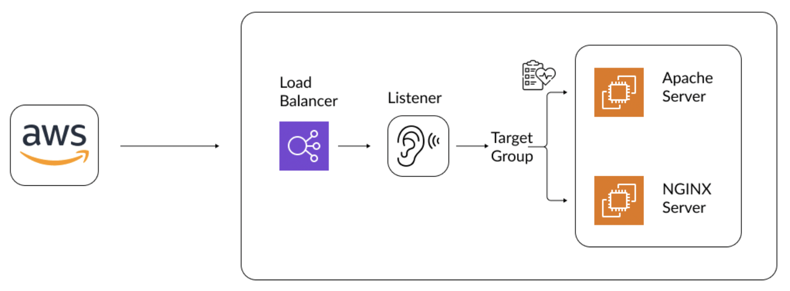
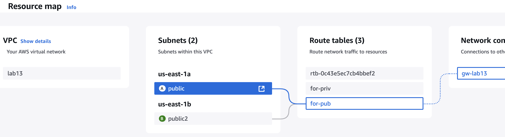
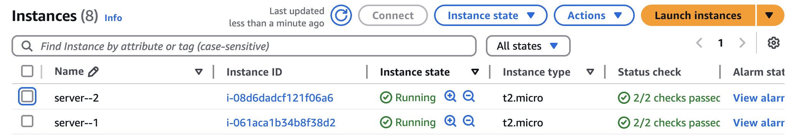
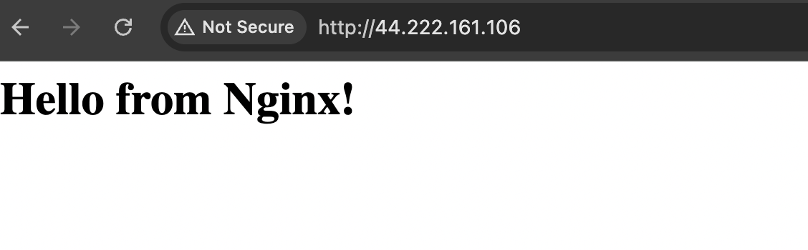
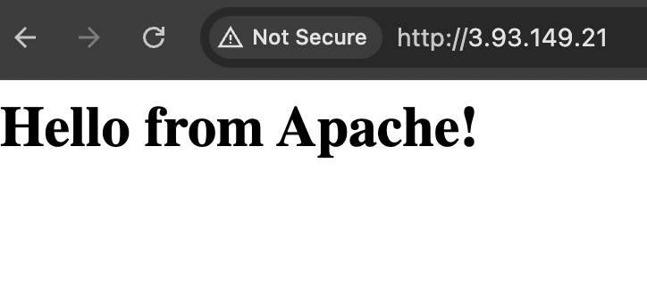
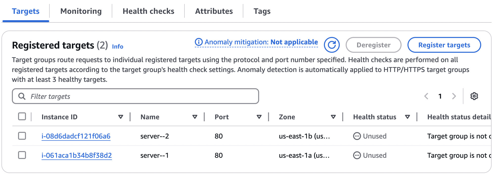
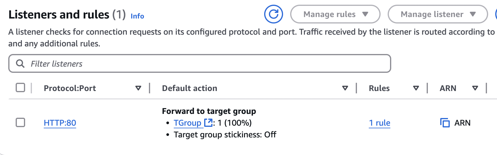
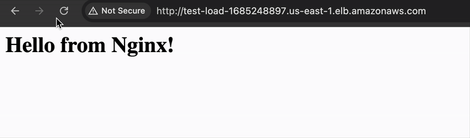

# 🚀 AWS Load Balancer with EC2 (Nginx & Apache)

## 📖 Overview
This project demonstrates how to set up an **AWS Application Load Balancer (ALB)** with **two EC2 instances** running **Nginx and Apache**.  

## 🎯 Architecture Diagram

### **🛠️ Components Used**
- **VPC** with 2 public subnets  
- **2 EC2 instances** (One with Nginx, one with Apache)  
- **Application Load Balancer (ALB)** to distribute traffic  
- **Security Groups** for HTTP & SSH access  

---

## **📌 Setup Steps**
### 1️⃣ **Create a VPC & Subnets**
📷 Screenshot: 

### 2️⃣ **Launch EC2 Instances (Nginx & Apache)**
📷 Screenshot: 

### 3️⃣ **Test EC2 installing Nginx & Apache**
- **Nginx:** 
- **Apache:** 

### 4️⃣ **Create and Configure Target Group**
📷 Screenshot: 

### 4️⃣ **Create and Configure Load Balancer**

📷 Screenshot: 
 

---

## **🖥️ Access the Application**
1. Get the **Load Balancer DNS Name**:
2. Open a browser and visit:  
🎥 

---
