# **AWS S3 CLI Lab**  
This project demonstrates how to use the AWS CLI to interact with Amazon S3, including:  
- Creating an S3 bucket  
- Configuring permissions  
- Uploading and downloading files  
- Enabling versioning  
- Enabling logging  

---

## **📌 Step 1: Create an S3 Bucket**  
📸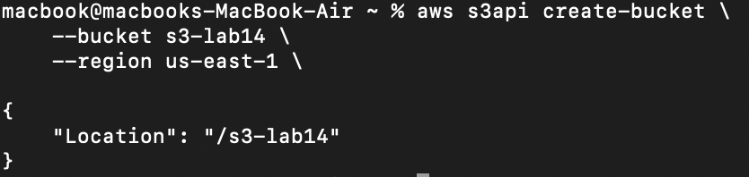

**Verify bucket creation:**  
 📸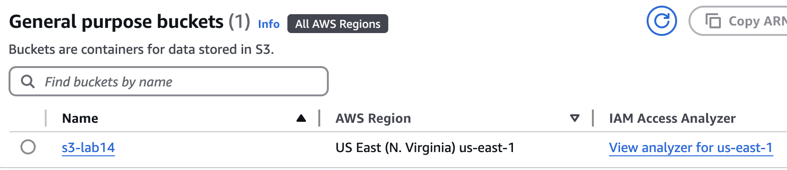

---

## **📌 Step 2: Configure Permissions**  
**To make (Block Public Access):**
 📸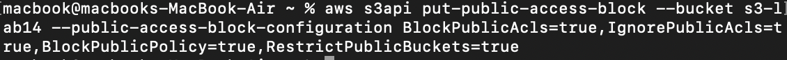


**add a policy allowing full permission  to a specific ip address(my ip):**
 📸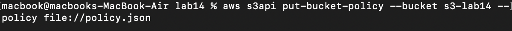
 
   1️⃣ Before appling policy 

   📸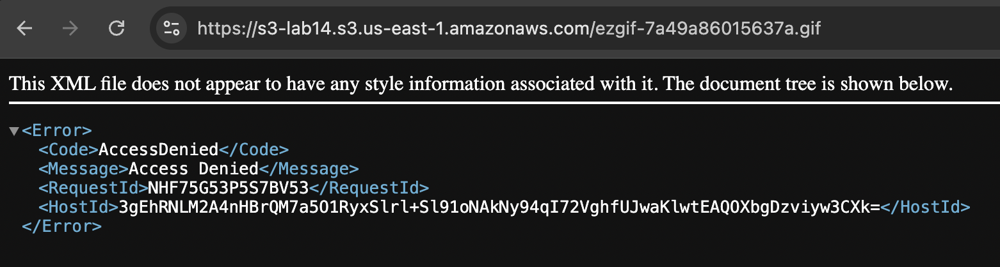
   2️⃣ After appling policy

   📸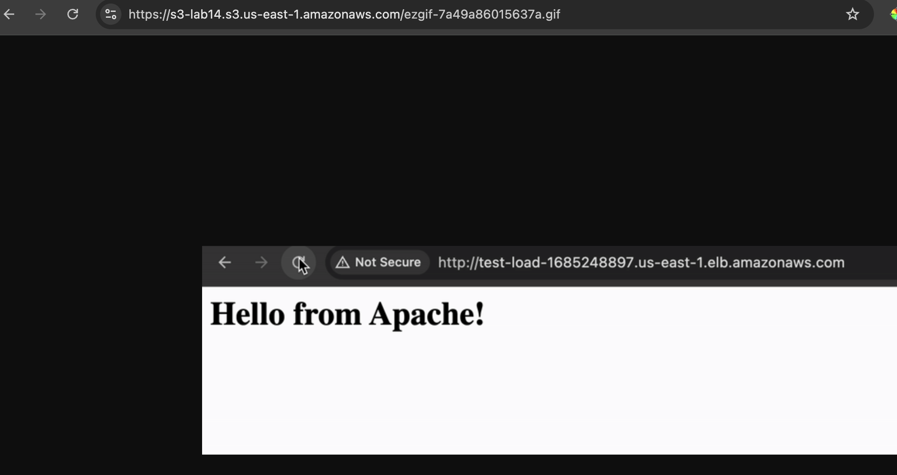

---

## **📌 Step 3: Upload a File to the Bucket**  
**Upload image to the bucket:**
 📸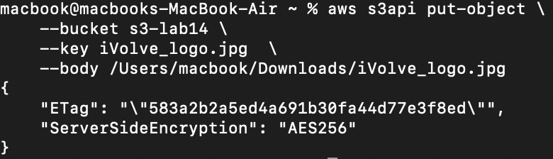

**Verify upload:** 
 📸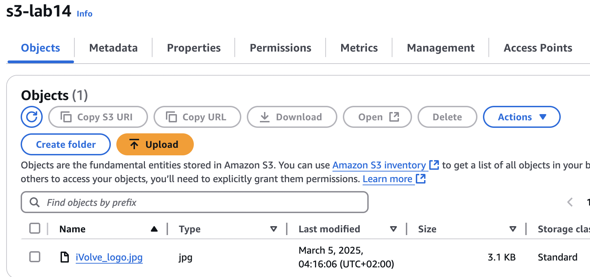

---

## **📌 Step 4: Download a File from the Bucket**  
 📸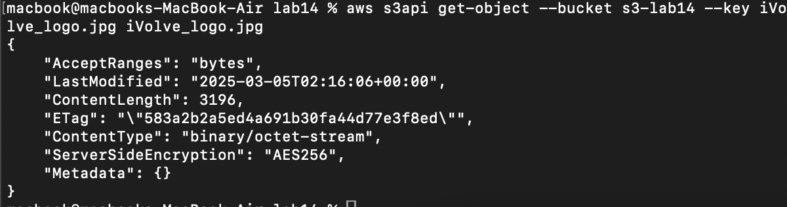

---

## **📌 Step 5: Enable Versioning**  
 📸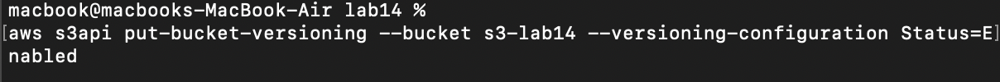


 **Verify Versioning:**  
 📸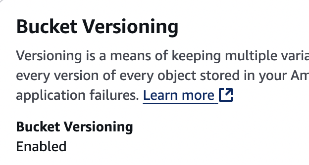

---

## **📌 Step 6: Enable Logging**  
### **1️⃣ Create a Logging Bucket (If Not Already Created)**
```sh
aws s3 mb s3://s3-logging-bucket-s3-lab14-logs
```
### **2️⃣ Attach a Bucket Policy to Allow Logging**
 📸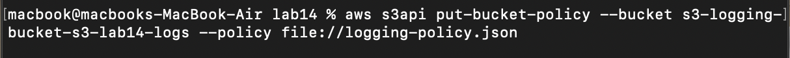

### **3️⃣ Enable Logging on the Source Bucket**
 📸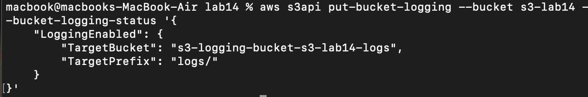
 
 Verify Logging: 
 📸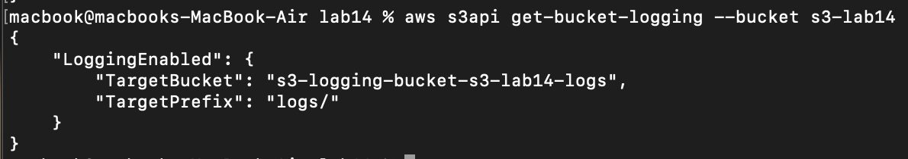

---

## **🎯 Summary**  
✔ Created an S3 bucket  
✔ Configured permissions  
✔ Uploaded & downloaded files  
✔ Enabled versioning  
✔ Enabled and verified logging  

---


