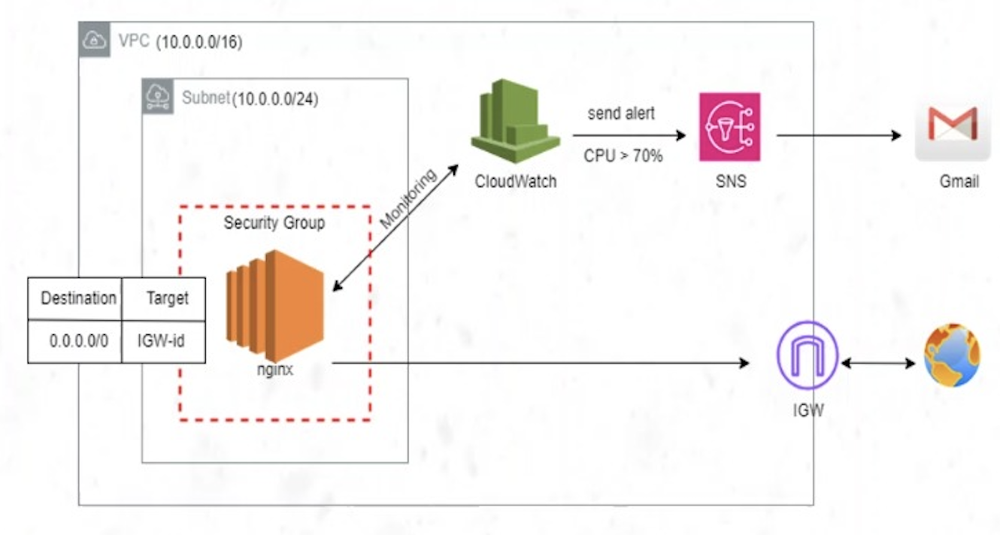
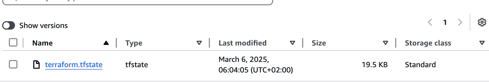
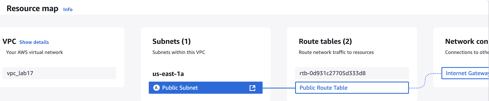
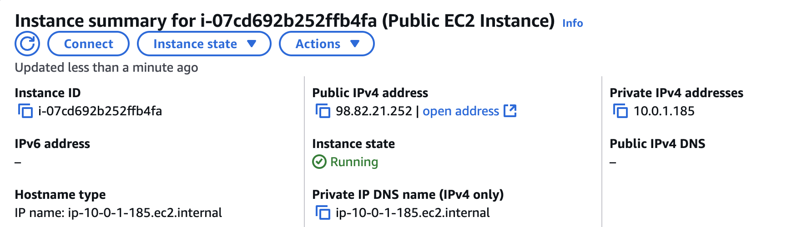
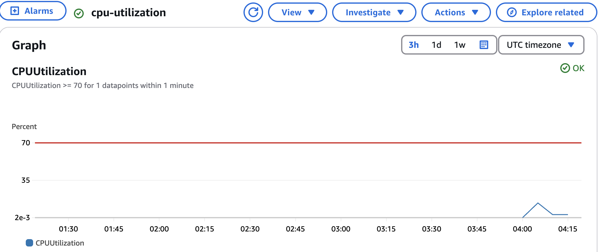
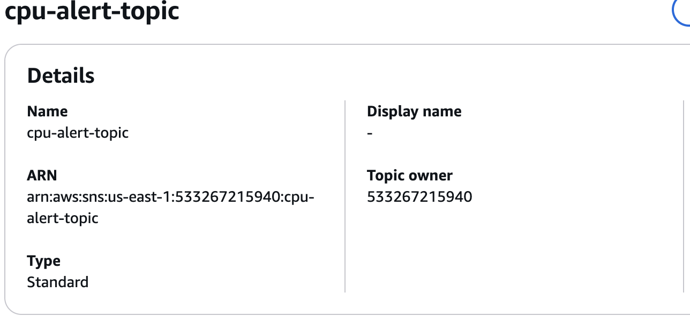
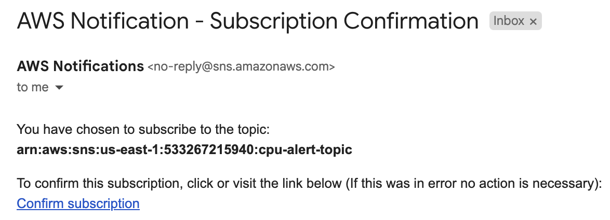
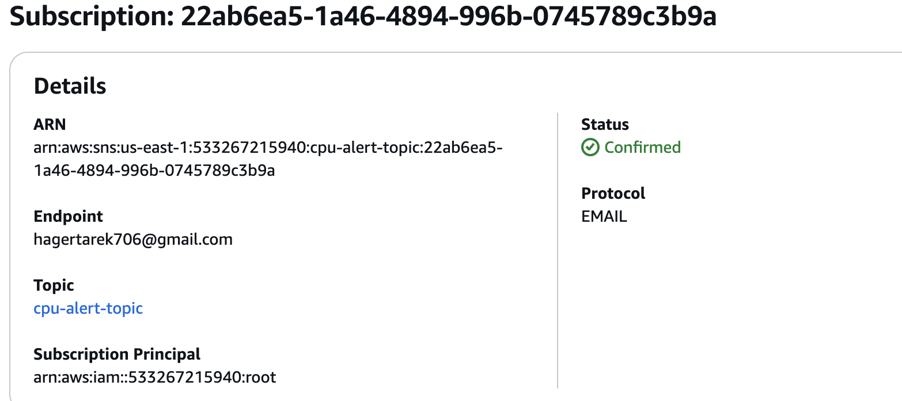
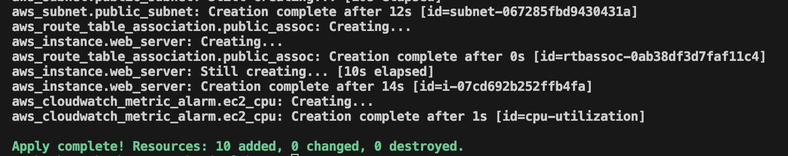

# 🚀 AWS Infrastructure-as-Code with Terraform  

## 📌 Project Overview  
This project demonstrates how to use **Terraform** to provision and manage an AWS infrastructure. The main components include: 
- **VPC (Virtual Private Cloud)**
- **Public Subnet**
- **Internet Gateway for internet access**
- **Route Table & Association** 
- **EC2 instance** running **NGINX**  
- **Terraform remote state storage** in **S3**  
- **CloudWatch monitoring** for CPU usage  
- **SNS notifications** to send alerts  
- **Lifecycle rules** to ensure smooth deployments  

---

## 📁 Project Structure  

This repository is organized as follows:  
```

lab17/
  │── backend.tf        # Defines S3 remote backend for Terraform state 
  │── cloudwatch.tf     # Configures CloudWatch monitoring and alarms 
  │── main.tf           # Deploys EC2 instance with NGINX setup 
  │── sns.tf            # Configures SNS for notifications
```

---

## 🏗 Architecture Overview  

The architecture consists of the following:  

- A **VPC** with a **public subnet**  
- An **EC2 instance** that runs **NGINX** using user data  
- A **security group** allowing HTTP (80) and SSH (22) access  
- **CloudWatch monitoring** that triggers an alarm if **CPU usage exceeds 70%**  
- An **SNS topic** that sends email notifications when the alarm is triggered  
- A **Terraform remote backend** in **S3** for storing the state file  
- Use of **Lifecycle Rules** (`create_before_destroy`) to ensure a new instance is created before the old one is terminated  

📌 **Architecture Diagram**  


---

## ⚙️ **Step 1: Configure the Terraform Backend**  

- The **Terraform state** is stored remotely in an **S3 bucket** to enable team collaboration and state locking.  



---
## 🖥 **Step 2: Create a VPC**  
- The **CIDR block** is set to `10.0.0.0/16`.
- **Create a Public Subnet** is set to `10.0.0.0/24`,It is associated with our VPC.
- **Create an Internet Gateway (IGW)**.  
- The IGW is created and **attached to the VPC**.
- **Create a Route Table & Associate with Subnet**.

 

---
## 🖥 **Step 3: Deploy an EC2 Instance with NGINX**  

- An **EC2 instance** is created using a **pre-configured Amazon Machine Image (AMI)**.  
- **User data** is used to automatically install and start **NGINX** upon launch.  
- The instance is associated with a **security group** allowing HTTP (80) and SSH (22) traffic.  



**Verification:**  
- After deployment, access the EC2 instance's **public IP** 
📌 **Screenshot of NGINX running:**  


---

## 📊 **Step 4: Configure CloudWatch Monitoring**  

- **CloudWatch alarms** are set to monitor the EC2 instance's **CPU utilization**.  
- If the CPU usage exceeds **70%**, an alarm is triggered.  
- The alarm sends a notification to **SNS**.  

📌 **Screenshot of CloudWatch alarm:**  
  

---

## 📢 **Step 5: Configure SNS Notifications**  

- **Simple Notification Service (SNS)** is used to send alerts via **email** when the CloudWatch alarm is triggered.  


- The recipient must **confirm the email subscription** to receive notifications.  


📌 **📧 Ensure you check your email and confirm the subscription.**  



---

## 🚀 **Step 6: Deploy the Infrastructure**  

1. **Initialize Terraform**  
2. **Plan the changes**  
3. **Apply the configuration**   

📌 **Screenshot of Terraform apply output:**  

  

---

## 🎯 **Key Features**  

✔️ **Remote backend (S3)** for state management  
✔️ **Automated NGINX deployment** using EC2 user data  
✔️ **CloudWatch monitoring** with an SNS notification system  
✔️ **Lifecycle rule** to create a new instance before deleting the old one  
✔️ **Security best practices** with properly configured security groups  

---
