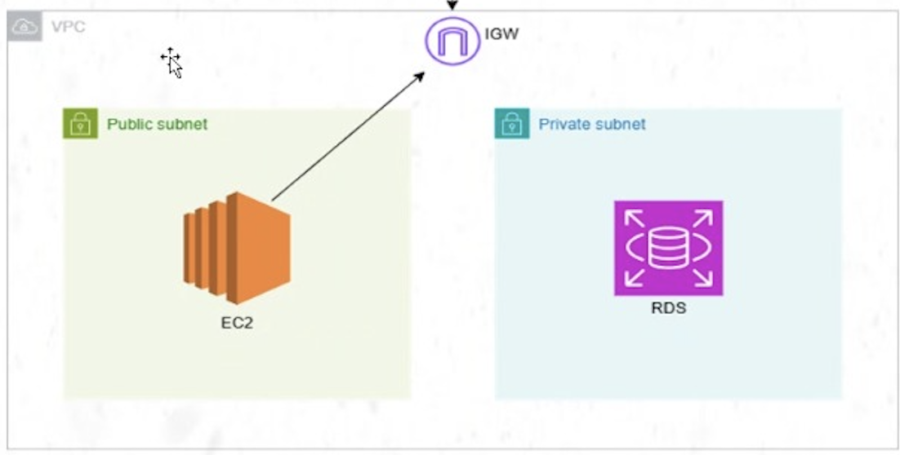
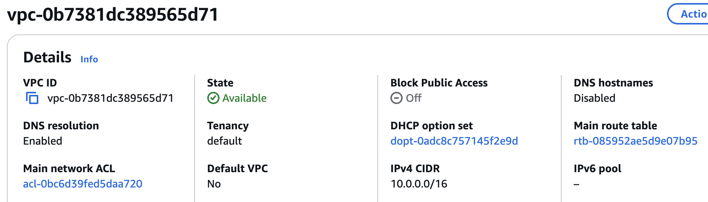
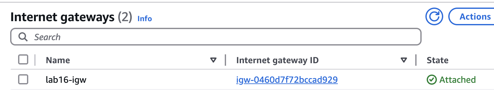
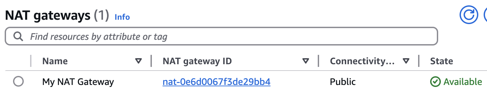
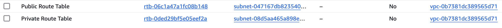
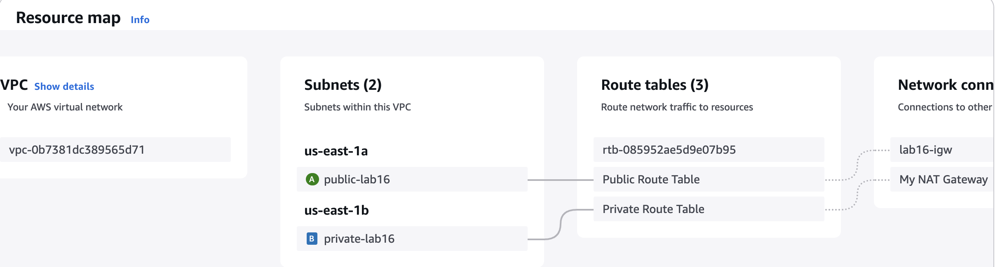
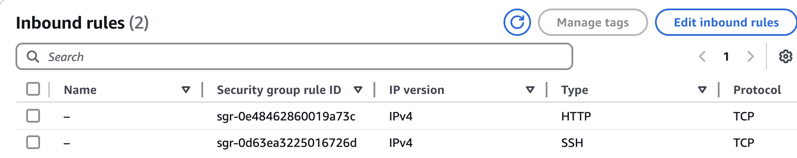
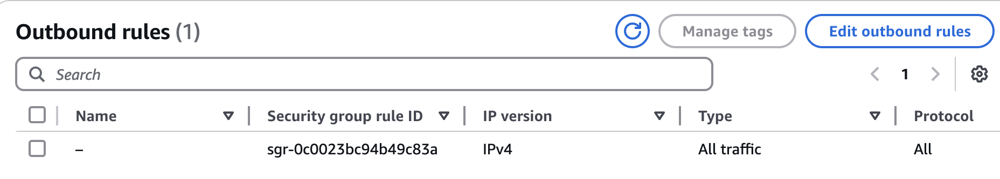
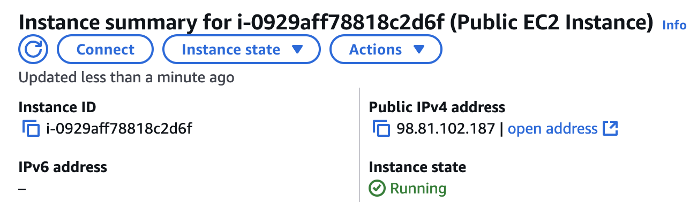
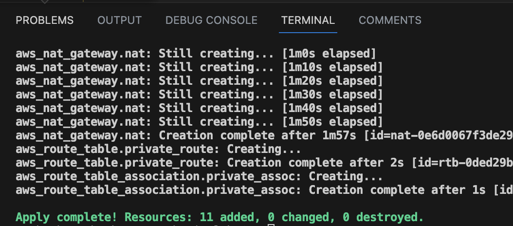

# 🌍 AWS Infrastructure with Terraform

This project provisions an AWS infrastructure using Terraform. The process started by **manually creating a VPC** in AWS, then **importing it into Terraform**, and finally building the full infrastructure step by step.



---

## 📌 Steps to Build the Infrastructure

### 1️⃣ **Create VPC Manually**
- Go to **AWS Console** → **VPC**
- Create a **VPC** with CIDR `10.0.0.0/16`

📸

---

### 2️⃣ **Import VPC into Terraform**
Once the VPC was manually created, we **imported** it into Terraform.

```bash
terraform import aws_vpc.existing_vpc vpc-0b7381dc389565d71
```

---

### 3️⃣ **Create Terraform Files**
After importing the VPC, we **structured our Terraform files** as follows:

```
.
├── ec2.tf                  # EC2 instance configuration
├── main.tf                 # Main Terraform file
├── nat.tf                  # NAT Gateway configuration
├── route_tables.tf         # Route tables for public and private subnets
├── security_groups.tf      # Security groups for EC2 and RDS
├── subnets.tf              # Public and private subnets definition
├── terraform.tfstate       # Terraform state file 
├── .gitignore              # Ignore sensitive files in Git
├── ec2-ip.txt              # Stores the public IP of the EC2 instance
└── README.md               # Project documentation
```

---

### 4️⃣ **Define Subnets (`subnets.tf`)**
We created:
- **Public Subnet** (`10.0.1.0/24`) → Where EC2 will be deployed
- **Private Subnet** (`10.0.2.0/24`) → Where RDS will be deployed

---

### 5️⃣ **Create Internet Gateway**
To allow public internet access for EC2:

📌 **Why?**  
- Public subnet needs **Internet Gateway** to access the internet  
- Private subnet will use **NAT Gateway** to access the internet 

📸

---

### 6️⃣ **Create NAT Gateway**
To allow private instances to reach the internet:

📌 **Why?**  
- Private instances **cannot** have a public IP  
- NAT Gateway allows private instances (like RDS) to update and communicate securely  

📸


---

### 7️⃣ **Set Up Route Tables (`route_tables.tf`)**
- Public subnet routes **all traffic (0.0.0.0/0)** to **Internet Gateway**
- Private subnet routes **all traffic (0.0.0.0/0)** to **NAT Gateway**
 
📸

---
## finaly structure

📸
---


### 8️⃣ **Define Security Groups (`security_groups.tf`)**
- Allow **SSH & HTTP access** to **EC2**  
- Allow **RDS traffic** from **EC2 only**  

📌 **Why?**  
- EC2 needs **SSH (22)** for remote access  
- EC2 needs **HTTP (80)** for web server 





---

### 9️⃣ **Deploy EC2 in Public Subnet (`ec2.tf`)**

📌 **Why?**  
- Placed in **Public Subnet**  
- **Public IP** is stored in `ec2-ip.txt`  



---

## 🚀 **Deploying the Infrastructure**
```bash
terraform init
terraform plan
terraform apply -auto-approve
```


---

