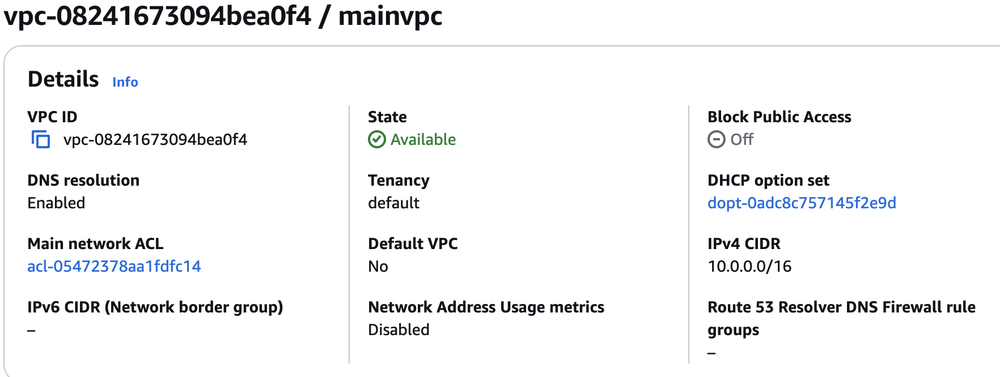
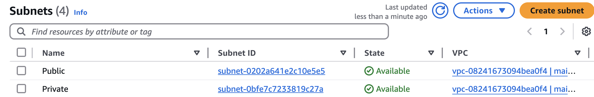
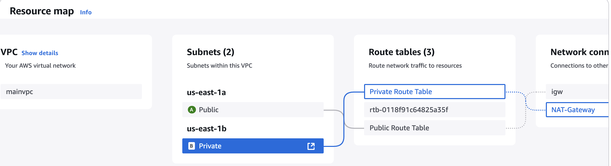
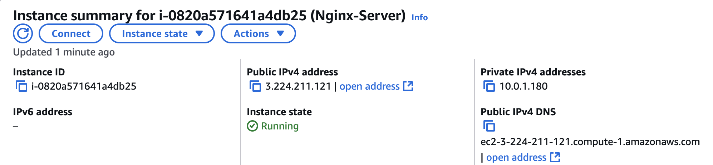
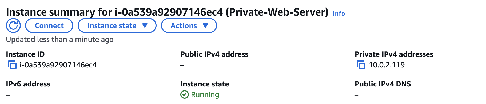
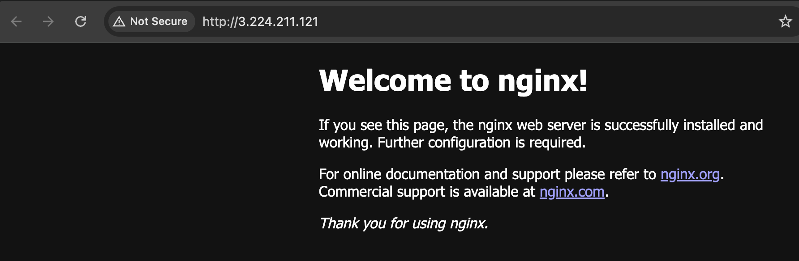
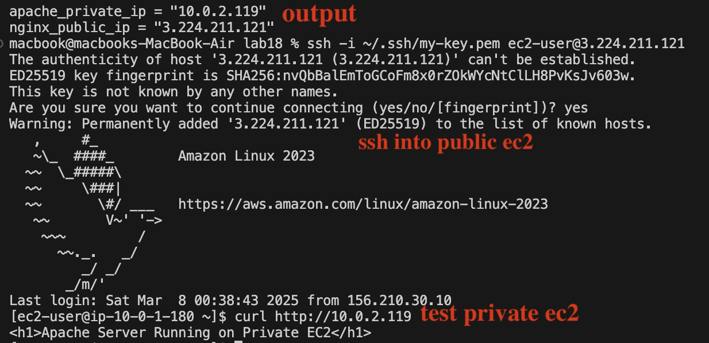

# **📌 AWS Infrastructure Deployment with Terraform**  
### **🚀 Infrastructure as Code (IaC) using Terraform**  

## **📂 Project Overview**  
This project automates the deployment of a **secure and scalable web infrastructure** on AWS using **Terraform**. The architecture consists of a **publicly accessible Nginx web server** and a **privately hosted Apache web server**, ensuring a **secure and efficient networking setup**.  

### **🔹 Key Features:**  
✔️ **Custom VPC** with Public & Private Subnets (**Created Dynamically Using Variables**)  
✔️ **Public EC2 Instance (Nginx Server) with Internet Access**  
✔️ **Private EC2 Instance (Apache Server) Accessible Only from Public EC2**  
✔️ **Internet Gateway (IGW) for Public EC2 Internet Access**  
✔️ **NAT Gateway for Private EC2 Internet Access Without Public Exposure**  
✔️ **Security Groups Configured Using Variables to Control Access**  
✔️ **Route Tables Dynamically Assigned Using Variables**  

---

## **🌍 Architecture Diagram**  


---

## **📂 Terraform Project Structure**  
This project is modular and structured efficiently to **avoid code repetition** by using **variables and loops**.  

```
/terraform-aws-project
├── ec2.tf               # EC2 Instances (Nginx & Apache)
├── igw.tf               # Internet Gateway
├── nat.tf               # NAT Gateway & Elastic IP
├── outputs.tf           # Terraform Outputs
├── provider.tf          # AWS Provider Configuration
├── route-tables.tf      # Public & Private Route Tables 
├── security_groups.tf   # Security Groups (Using Variables)
├── subnets.tf           # Public & Private Subnets (Using Loop)
├── variables.tf         # Input Variables for Scalability
├── vpc.tf               # VPC Configuration
└── README.md            # Documentation (This File)
```

---

## **🛠 AWS Resources Created**  

### **1️⃣ VPC (Virtual Private Cloud)**
📌 **Dynamically Configured Using Variables**  
- A **custom VPC** is created for **network isolation**.  



---

### **2️⃣ Subnets (Created Using a Loop to Avoid Repetition)**
📌 **Public & Private Subnets Created Efficiently with Loops**  
- **Instead of manually defining each subnet**, Terraform dynamically creates them **using `for_each` in a loop**.  
- **All subnet configurations (CIDR blocks, availability zones, and public/private settings) are stored in `variables.tf`, making them flexible & reusable**.  
 


---

### **3️⃣ Internet Gateway & NAT Gateway**
📌 **Automated Internet Access Setup**  
- **Internet Gateway (IGW)** allows the public subnet to access the internet.  
- **NAT Gateway** ensures the private EC2 instance can download updates **without being publicly exposed**.  

---

### **4️⃣ Route Tables (Dynamically Assigned Using Loops & Variables)**
📌 **No Manual Route Table Assignments – Everything is Dynamic**  
- **Public Route Table** automatically routes traffic via **IGW**.  
- **Private Route Table** automatically routes outbound traffic via **NAT Gateway**.  
- **Terraform loops through subnets and assigns the correct route table automatically**.  



---

### **6️⃣ EC2 Instances (Provisioned Using Variables & User Data)**
📌 **EC2 instances are created dynamically using Terraform variables and automated provisioning scripts.**  

#### **Public EC2 Instance (Nginx)**
✔️ **Deployed in Public Subnet**  
✔️ **Automatically installs Nginx using `remote-exec` provisioner**  



#### **Private EC2 Instance (Apache)**
✔️ **Deployed in Private Subnet**  
✔️ **Uses `user_data` to automatically install Apache (`httpd`) on boot**  



---

## **✅ Verification & Testing**  

### **🔹 Testing Public EC2 (Nginx)**
1️⃣ Copy the **public IP** of the Nginx server from **output**.  
2️⃣ From web browser 



---

### **🔹 Testing Private EC2 (Apache)**
Since the **public EC2 (Nginx) and private EC2 (Apache) are in the same VPC**, we can test from the public EC2.

#### **🛠 Step 1: SSH into Public EC2 **

#### **🛠 Step 3: Run a curl test to the Private EC2’s private IP**



---
## 🚀 Deploy the Infrastructure**  

1. **Initialize Terraform**  
2. **Plan the changes**  
3. **Apply the configuration**   

📌 **Screenshot of Terraform apply output:**  

  

---
## **📌 Key Achievements of This Project**
✔️ **AWS Infrastructure Fully Automated with Terraform**  
✔️ **Code Reusability Using Loops & Variables (Subnets, Route Tables, Security Groups)**  
✔️ **Highly Secure Architecture (Private EC2 Hidden from the Internet, Bastion Host for Access)**  
✔️ **Automated Provisioning (User Data & Remote Exec to Configure Web Servers)**  
✔️ **Internet Access Managed via IGW (Public) & NAT Gateway (Private)**  
✔️ **No Manual Changes Needed – Everything is Defined in Terraform Code**  

---
