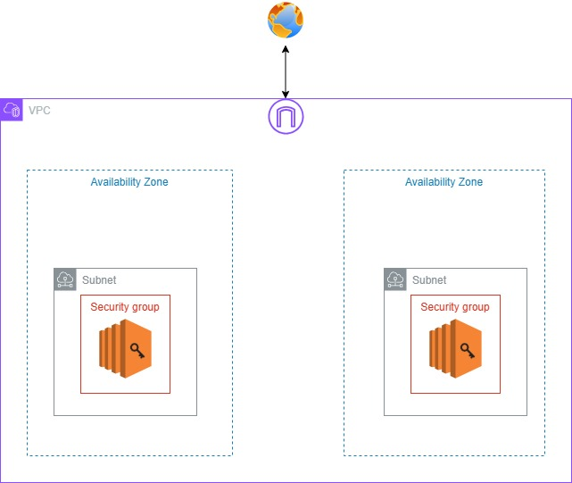
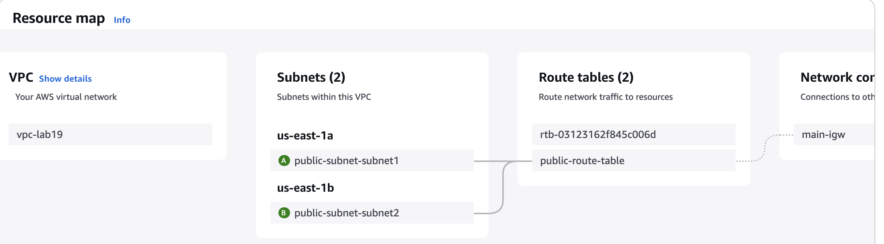
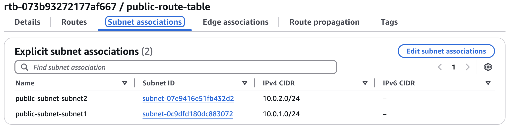
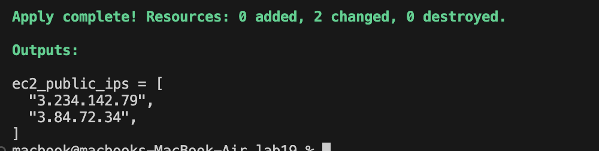
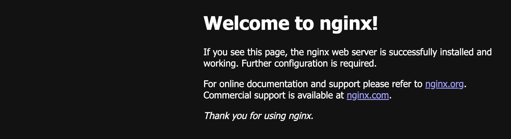

# 🏗️ AWS Infrastructure with Terraform

## 📌 Project Overview
This project automates the deployment of an **AWS cloud infrastructure** using **Terraform modules**. 
The setup includes:

✅ **VPC** – Creates a secure AWS network.  
✅ **Public Subnets** – Allows instances to be accessible over the internet.  
✅ **Internet Gateway & Route Tables** – Provides internet access to resources.  
✅ **Security Groups** – Controls access to EC2 instances.  
✅ **EC2 Instances** – Deploys web servers automatically.  
✅ **Terraform Modules** – Makes the setup **scalable and reusable**.  

---

## 🏗 Project Architecture
The infrastructure is structured into **two main modules**:

1️⃣ **Network Module** – Creates VPC, subnets, IGW, and route tables.  
2️⃣ **Server Module** – Launches EC2 instances and configures security groups.  

**Terraform Features Used:**
- **Modules**: Organizes code for reusability.  
- **Loops (`for_each`)**: Dynamically creates multiple subnets.  
- **Variables**: Allows configuration without modifying code.  

## **🌍 Architecture Diagram**  


---

## 📂 Project Structure

```
terraform-aws-project/
│── modules/
│   ├── Network/
│   │   ├── 1-igw.tf
│   │   ├── 2-vpc.tf
│   │   ├── 3-variables.tf
│   │   ├── 4-subnets.tf
│   │   ├── 5-route-tables.tf
│   │   ├── 6-outputs.tf
│   ├── Server/
│   │   ├── 1-ec2.tf
│   │   ├── 2-outputs.tf
│   │   ├── 3-security_groups.tf
│   │   ├── 4-variables.tf
│── main.tf
│── terraform.tfvars
│── variables.tf
│── README.md
```

Each module is independent and reusable.

---

## 🔧 How the Infrastructure Works

### 1️⃣ Network Module  
The `Network` module creates all the necessary AWS networking components:  

- **VPC** (Existing VPC is used)  
- **Public Subnets** (Dynamically created using `for_each`)  
- **Internet Gateway (IGW)** for internet access  
- **Route Table** to allow traffic to flow through IGW  



#### 🔹 Using Loops (`for_each`) for Subnets  
Instead of defining each subnet manually, I used a **loop (`for_each`)** to create them dynamically.




---

### 2️⃣ Compute (EC2) Setup  
The `Server` module launches EC2 instances:  

- **Two EC2 instances** in different public subnets.  
- **User Data** script installs **Apache** automatically on boot.  
- **Security Groups** allow HTTP (80) and SSH (22) access.  

#### 🔹 Using Variables for EC2 Configuration  
Instead of hardcoding values, I used Terraform **variables** to make the EC2 setup configurable:

✅ **AMI ID** – Easily changeable for different OS versions.  
✅ **Instance Type** – Can be adjusted for different workloads.  
✅ **Key Pair** – Allows secure SSH access.  


---

## 🛡 Security & Access Control  
- **Security Groups** restrict access:  
  - **HTTP (80)** is open to the world (`0.0.0.0/0`).  
  - **SSH (22)** is restricted to a trusted IP range.  
- **Key Pair Authentication** for secure access.  

---

## 📝 Terraform Workflow  

### 1️⃣ Clone the Repository
```sh
git clone https://github.com/your-username/terraform-aws-project.git
cd terraform-aws-project
```

### 2️⃣ Configure Terraform Variables
Modify the `terraform.tfvars` file to set up your AWS environment:
```hcl
vpc_id = "vpc-072de937bf28a6aea"
key_name = "my-key"
public_subnets = {
  "subnet1" = { cidr_block = "10.0.1.0/24", az = "us-east-1a" },
  "subnet2" = { cidr_block = "10.0.2.0/24", az = "us-east-1b" }
}
ec2_ami = "ami-05b10e08d247fb927"
instance_type = "t2.micro"
```

### 3️⃣ Apply the Deployment
```sh
terraform apply -auto-approve
```
Terraform will create the AWS resources.



## 🌐 Accessing the Web Server
Once deployed, can access the web server by visiting:




---

## 🚀 Key Benefits of This Approach  
✅ **Modular & Reusable** – Easily add more subnets or EC2 instances.  
✅ **Automated & Scalable** – Uses loops (`for_each`) for dynamic resource creation.  
✅ **Flexible** – Uses variables to allow easy configuration.  
✅ **Secure** – Follows best practices for AWS networking & security.  

---
